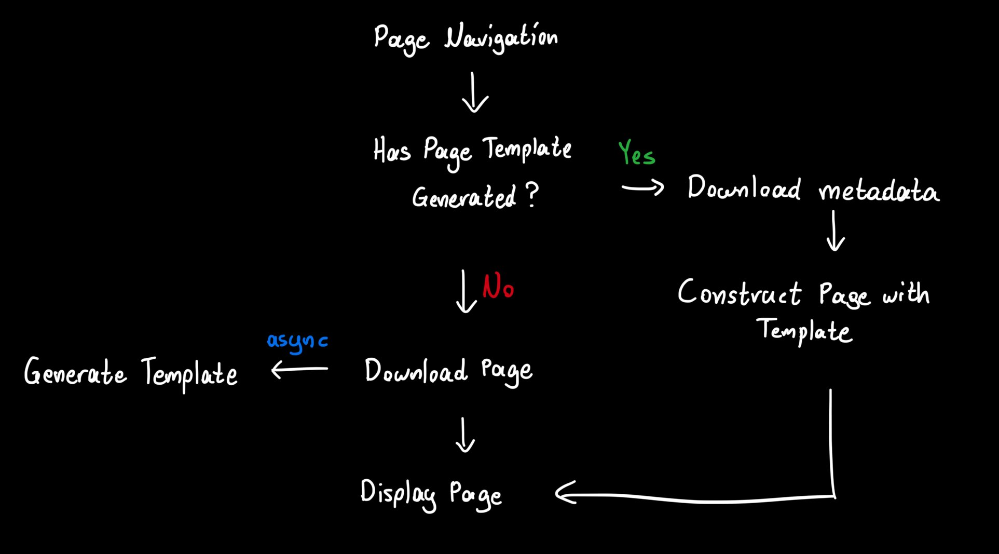

## Overview
TRIA (Templatable Rich Internet Applications) is an unofficial specification that aims to achieve composability of HTML responses for dynamic content, enabling zero-latency page navigations on a Multi-Page Application, as well as providing network benefits by not requiring to download unnecessary assets when navigating across dynamic pages.

## The problem
Let's suppose a website has a dynamic page where each user can view their own profile. For example, the paths for those subpages would be `/user/1`, `/user/2`, [...].

These pages are dynamic, meaning that their content is constructed based on some *metadata*. In the context of users, that metadata could be the user's username; their display name; their bio; their date of birth; etc.. Save for the aforementioned, the pages `/user/1` and `/user/2` usually have no other differences. That means we can create a template for that page, which can be used to generate every user page possible given a minimal amount of data.

## The proposal
TRIA proposes a standard for providing template-building instructions, such that clients can generate dynamic pages by requiring only the metadata that is required to render the page.

These instructions lay inside HTML elements with the `tria-` prefix, followed by a declaration. They can be attributes or comments, and their syntax varies depending on the instruction.

## Example
Below is an example HTML response that satisfies the TRIA standard:

```html
<html>
  <body>
    <main>
      <h1 tria-content="greetingMessage" tria-attr="title:greetingMessage" title="Hi, Mary.">Hi, Mary.</h1>
      <p>Here is a list of today's tasks:</p>
      <ul>
        <!-- tria-list-start items (for item of items) -->
        <!-- tria-list-item -->
        <li tria-content="item.title">Finalize acquisition draft.</li>
        <!-- tria-list-item -->
        <li tria-content="item.title">Examine applicants' tests.</li>
        <!-- tria-list-item -->
        <li tria-content="item.title">Create sprint tickets for all teams.</li>
        <!-- tria:list-end items -->
      </ul>
      <button tria-if="tria.array.noempty(tasks.items)">Clear all</button>
    </main>
  </body>
</html>
```

Given the above HTML, the client can now generate that page with any metadata of the following form:

```json
{
  "greetingMessage": "Hi, Mary.",
  "tasks": {
    "items": [
      {
        "title": "Finalize acquisition draft."
      },
      {
        "title": "Examine applicants' tests."
      },
      {
        "title": "Create sprint tickets for all teams."
      },
    ]
  }
}
```

## How it works
Under the hood, when HTML is received by the client, it transforms the response into a template that can be used to reproduce the input HTML by providing the appropriate metadata. This template can be of any shape. TRIA does not concern itself with the underlying implementation, and is compatible with most templating engines to act as intermediaries.

For example, a transformation with a custom language would look like:

```html
<html>
  <body>
    <main>
      {
        set (0.content, metadata.greetingMessage)
        set (0.attr:title, metadata.greedingMessage)
        <h1></h1>
      }
      <p>Here is a list of today's tasks:</p>
      <ul>
        {
          for (item of metdata.tasks.items) {
            set (0.content, item.title)
            <li></li>
          }
        }
      </ul>
      {
        if (nonempty(metadata.tasks.items))
        <button>Clear all</button>
      }
    </main>
  </body>
</html>
```

For clarity, the above template in JSX would look like:

```jsx
<html>
  <body>
    <main>
      <h1 title={metadata.greetingMessage}>{metadata.greetingMessage}</h1>
      <p>Here is a list of today's tasks:</p>
      <ul>
        {metadata.tasks.items.map(item => (
          <li>{item.title}</li>
        ))}
      </ul>
      {metadata.tasks.length > 0 && (
        <button>Clear all</button>
      )}
    </main>
  </body>
</html>
```

## TRIA's purpose
TRIA defines a set of rules that must be satisfied in order for the HTML to be able to be transformed into a template.

## Design overview
As stated above, TRIA's main purpose is to provide a well-defined client solution to saving on bandwidth and network delay for retrieving data that the client probably already has. If the metadata for a specific page is locally cached, the network delay for a page navigation in a Multi-Page Application can become zero.

Below is a high-level illustration of how TRIA intends to intercept document downloading upon page navigation.


